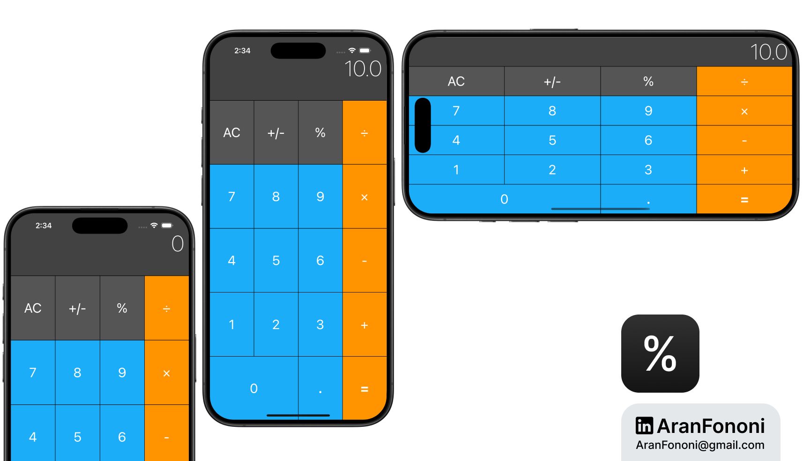

# Calculator - Simple Arithmetic Calculator

### Project for Section 21: **Basic Calculator App**  
This project was completed as part of Section 21 in the **Complete iOS Development Bootcamp** by Angela Yu.

## Project Overview
The **Calculator** app performs basic arithmetic operations such as addition, subtraction, multiplication, and division, designed with a simple and user-friendly interface. The app is structured with a clear MVC pattern and incorporates a custom **CalculatorLogic** class to manage calculations independently of the UI.

## What I Learned
In this project, I focused on:
- **Modular Code Structure**: Implemented a separate `CalculatorLogic` struct to handle arithmetic operations, enhancing modularity and separation of concerns.
- **Swift Fundamentals**: Strengthened understanding of structs, methods, and properties in Swift by developing reusable logic for various calculator functions.
- **Error Handling**: Applied basic error handling to manage invalid inputs and unexpected behaviors in calculations.

## Key Skills
- Modular programming and separation of logic using Swift structs
- Effective use of properties and methods for handling UI-based calculations
- Error management and app stability in basic operations

## Additional Features
- Handles edge cases for division by zero and decimal point handling.
- Supports operations such as percentage and toggle for positive/negative values.

---

### Project Preview

---

### Footer

---

## Contact
For more information, feel free to reach out:  
- **Email**: [aranfononi@gmail.com](mailto:aranfononi@gmail.com)  
- **LinkedIn**: [Aran Fononi](https://www.linkedin.com/in/aran-fononi-18182b265)
